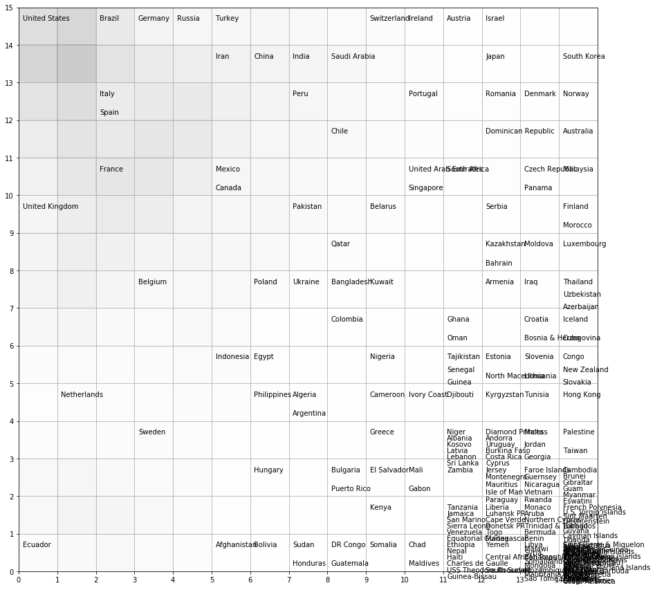
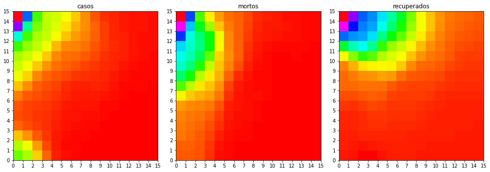
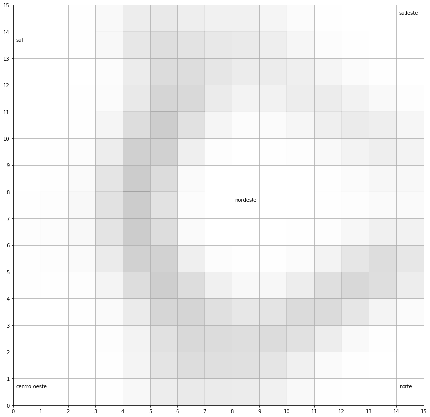
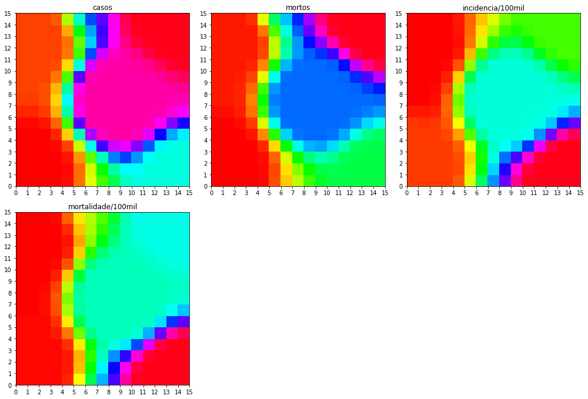
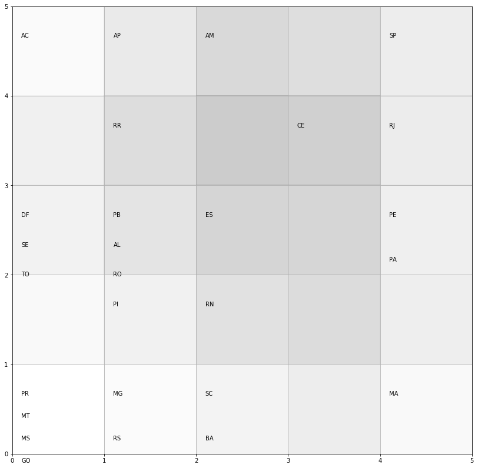
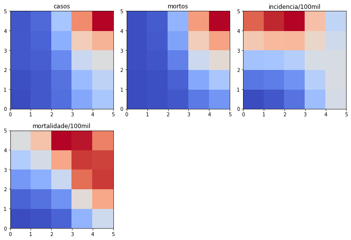
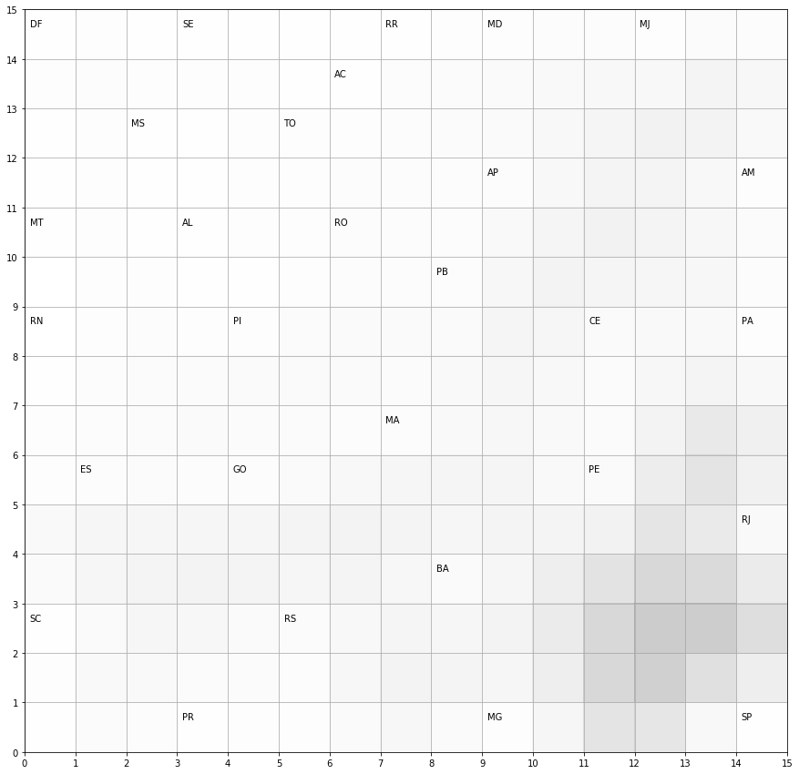
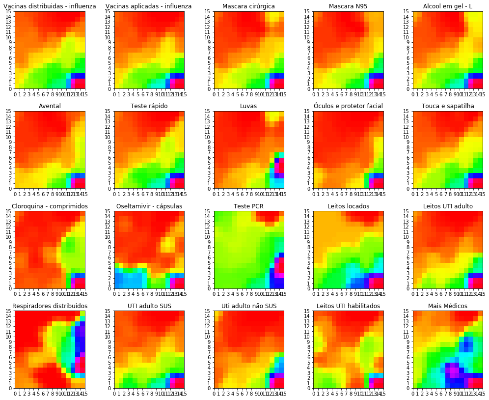

<h1 align="center">
   
 Self Organizing Maps de Kohonen 

</h1>

  
  

## :rocket: Como executar
Basta baixar todos os arquivos em uma pasta e executar no terminal:
python covid.py

obs.: Você precisa ter o python instalado

## :computer: Saidas

  <h2>Covid no mundo</h2>
  
  

  <h2>Covid por região no Brasil</h2>
  
  

  <h2>Covid nos estados brasileiros</h2>
  
  

  <h2>Covid gastos dos estados brasileiros em insumos</h2>
  
  

